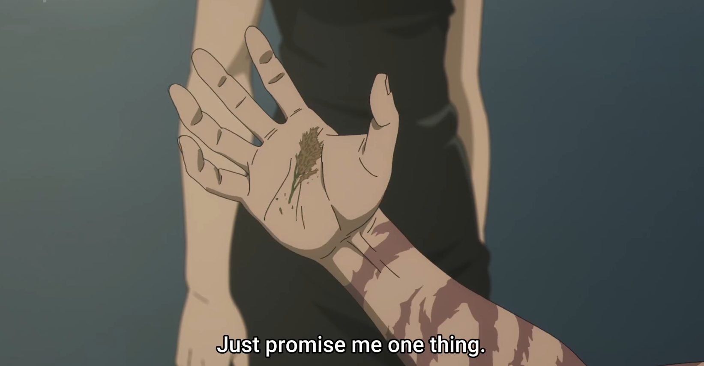

# Pre-amble

A little pre-amble before I rant for far too long: this specific blog post is going to be my review of the fourth episode of season 3. Obviously, there's no way it will be spoiler-free, so I highly suggest readers to go watch the episode for themselves before going forward. Not only does this make you a more informed reader, but it also provides you the basis to make a (mostly) unbiased opinion on the season so far in Jujutsu Kaisen (JJK).

Alright, so why am I reviewing this episode and not the whole season, the same as I did before? Well… let’s just say episode 4 has been making the rounds on both Western and Japanese social media, and viewers are extremely divided. For reference, IMDB https://www.imdb.com/title/tt39370459/ has rated this episode a 9.8/10. That’s 0.1 lower than the finale for Breaking Bad. Yes, THAT finale. In internet fashion, Twitter, Instagram, and TikTok have been reposting posts about this rating, and it’s finally reached the Japanese audience, who, let’s just say, aren’t too pleased.

Okay I say Japanese audience, but what I really mean is “Japanese viewers who are tapped into western social media and who have decided to make comments disparaging the ratings from Westerners.” Many of the opinions that I see are along the lines of people in the West really only care about crazy fights and that any show that has such will be rated highly.

As someone who has grown up in the West, but has lived in Japan, I have a small but unique perspective into the opinions of both. As such, I just thought I’d pour out my thoughts here- my thoughts which are extremely biased by my perspective and by what makes me enjoy a show. So, let’s get started.

## Episode 4 - Glaze or Glory?

For me, it’s simply Glory.

I’ll analyze what I saw and thought of in the episode (disclaimer: my memory is honestly bad when it comes to remembering shows. What I’m really saying is that I can’t easily recall the events of season 1, season 2 without a recap, which I’ve read a bunch about of course. I’m trying to accept this episode in a vacuum, as if it’s contained in its own universe)

### My Take

In this episode, we’re reminded that Megumi is now the head of the Zen’in clan. As a consequence, Maki is able to walk in and grab whatever cursed tools she’d like- or rather, what’s left in the bunker. 

Maki starts walking to the tool bunker, and we’re lightly reminded once again that her family doesn’t like her. On the way, she meets her mom who rejects her like a delinquent, and outright displays her anger for even giving birth to Maki. We pan immediately to some figureheads in the Hei (including Naoya) talking about killing Megumi and Maki to restore order to the clan. To do so, Maki’s own father is tasked with executing her. Without even saying anything else, we know that Maki is now being surrounded by the hatred and discontent of her existence in and of itself. Furthermore, the fact that her father pushed and accepted the role of executing his own daughter provides an extreme example of his dejection of Maki.

After some quarrel, Maki and Mai are unconscious and left to die. We’re thrown into a subconscious world where the two interact and decide how to go forward. As twin sorcerers, they’ve had an enormous amount of setbacks and conflict in their lives, and Mai realizes why: twins must split their abilities, one cannot have something that the other has.

At this point there’s some incredible symbolism with a Goose/Duck giving away its reed (shoutout Ryan who told me this). Essentially, the bird has reached the end of its life. It’s travelled far and wide, planning throughout life for the journey. The bird has realized its demise ahead, and decides to leave its lifeline, a reed, for those who follow. It’s the idea of preparation for the future, and sacrificing oneself for the safety and security of others.

Once Maki returns to the mortal world, Mai’s effect on her is clear. For the next ten minutes we see an absolute bloodbath of a battle. (Go watch it for yourself). Oh yeah, apparently there’s a Kill Bill reference (movie, not SZA as I’ve learned).

Upon the battle’s conclusion, we have a couple closing scenes that tie up the episode. Most importantly, after a final confrontation between the two, Maki’s mother's family acknowledges her, stating “I’m glad I gave birth to you;” a total turnaround from the beginning of the episode, where she stated “Just once, make me happy I gave birth to you.” Maki has finally gained the acknowledgement of her mother.

The final scene signifies exactly what the characters gained and lost. Firstly, is the physical ending to Mai, provided by Maki passing Mai’s body to her classmate. Secondly, is the beginning of change in Maki. I don’t know if I’m being too dramatic, but in this final scene it became apparent to me the physical growth Maki has undergone. She just killed every member of her clan at the residence, and still has the strength to carry her sister's body out from the bunker. Additionally, Maki is visually stronger. In my opinion, she looks larger- that might be because of the events I just watched in the show, but I'm now getting the idea that she's going to become a larger force in this arc going forward. And if I may, she's starting to resemble Toji, from a physical view.

## Wait… how about your standards?

Okay by standards I mean the standards I rate shows on: soundtrack, camera angle, etc. Honestly, I didn't go into the episode thinking I'd be doing a deep-dive, so it's hard for me to remember these things without rewatching. I don't want to be too critical, so I'll leave you guys with what I remember. The use of music, camera angles, heavy hitting animation, and everything else does one job amazingly: it sets the tone. When we're in a flashback, I'm pushed to feel nostalgic, and empathetic towards what the characters are feeling. Conversely, once the fights begin there's a clear tone for them: the Naoya-Maki battle is meant to be detailed, showing what the character's are thinking but also that this battle is more decisive than what we may see. In a similar yet different light, Maki's slaying of the Kukuru unit members references Kill Bill. It's not meant to be in-depth, and we don't really know who the characters that die are; and that's just that. People die, and the way that they do doesn't matter apart from the fact that it's a slaughter; so, let's have a bit of fun.

Alright at this point I'm honestly feeling a bit corny. I've never really cared too deeply for popular Shounen Anime to this aspect. I absolutely love watching a fight-fest that allows my brain relax and just follow the characters on a journey. Thus, writing this review is out-of-character for me. Yet I still feel that I need to do a service to those who love these action Anime just like I do- it doesn't need to be a storytelling, cinematic masterpiece to be the greatest; what matters most to me is that the show is digestable, immersive, and relaxing. Not once in this episode did I get bored and want to pick up my phone, and I think that's a great indicator of a well-crafted show for the masses.

## The Other Side
To hold an opinion, I believe it's only fair to consider the other side's opinion. I saw a tweet from a Japanese person saying that the angles and storyboards in the manga panels don't match the Anime at all. To me, that's a completely valid reason to consider an Anime differently than the Manga. But to discontinue the quality of the episode entirely feels unfair, or at least to me, misguided. Many viewers, Western and Japanese alike, have not consumed the source material at all. Hell, many source material for Anime don't even have drawings (light novels). If an Anime is able to convey the plot of the source material, and align as closely as possible to the emotions and thoughts of the characters, that's already more than one can ask for. Of course, we have extreme shows like The Promised Neverland that take liberty in the Anime's plot, and slop like One Punch Man Season 3 that are objectively poorly written shows. But to put this JJK episode into those buckets is not unjust.

## What am I really getting at
To me, this episode was glorious. It gave me something to feel sad about, but also something to excited for in the episode. I felt immersed with the characters, and I'm glad I got to watch the episode without others' opinions influencing me. My goal here isn't to create an argument about whether this episode is peak-fiction or not, it's to layout my thoughts and help those who enjoyed the episode realize that there was good reason to.

I still feel like this review will never be polished. I'm not literary genius, nor do I understand all of the workings that actually make a show objectively good. I'm just a person who's watched more Anime than the regular Joe, and writes reviews as a way to vocalize thoughts. I think there's a lot more aspects I should have rated this episode upon, but the parts that stuck out to me overshadowed them, which is more than fine. I just want to feel relaxed and always yearning for the next episode, and I hope others do too.

Just promise me one thing: Enjoy the shows that make you happy, without caring for what others say

