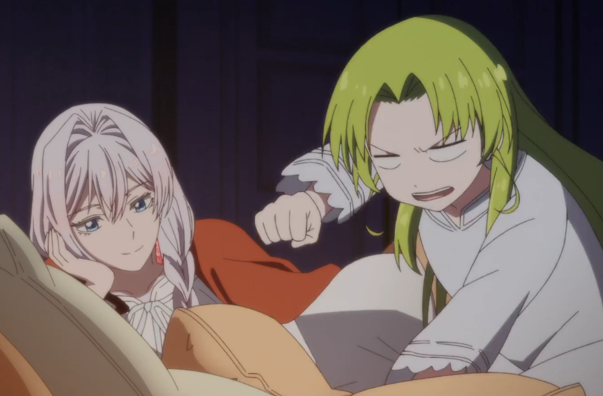

Preface: this is my first Anime review that I'm writing to this blog- I'm hoping it becomes a sort of passion-project where I lay out my full-fledged thoughts for any experience and audience-level to enjoy.

## Criteria
Since is the first of hopefully many, I want to add a note about the structure I want to take. Simply put, I want to review a show while I'm watching it and after I'm watching it; so hopeflly two updates to the blog post. The criteria I plan to use is as follows:

- Story
- Animation
- Soundtrack
- Music (Opening/Ending)
- Pacing
- Overall

## Let's beat corruption... literally
Have you ever been annoyed by the corruption of the world and wanted to physically outlet your anger somewhere? Well that's exactly what the main character does, every episode.

Saigo ni Hitotsu dake Onegai shitemo Yoroshii deshou ka (Saihito; "May I Ask for One Final Thing?") follows Scarlet, a noble villainess (Akuyaku is the term) who progresses through her daily life and finds joy in quite literally beating the lights out of corrupt politicians and nobles. In-fact, the first person she socks is someone who should have been very dear to her heart- at least to those in the public eye. This story makes for an interesting conflict-resolution for almost every episode so-far, meaning that in a vacuum, each episode is interesting.

The first few episodes don't do a good job at introducing the setting to you. I was literally shocked to learn that there was magic and dragons in this show, since the first episode had no lead-up indicating that that was the case. But simply put, imagine a world ruled by royalty, where a couple large religions prevail. There's magic, dragons, beastkin, Gods & Goddesses; and you know I wouldn't be surprised to see a goblin king appear in the last episode. Edit: no Goblin King, but a different king of fantastical creature appears...

~~So far, the story hasn't been anything particularly spectactular, but let's circle back to this part when I'm done the show. (To update!)~~
Story-wise (now that I've actually completed the series), it's been nothing spectactular nor lackluster. We have smaller adversaries that draw conflict to our heroine until a larger-than-life conflict appears to draw our main character and those around her into trouble. I don't want to spoil it too much, but I do want to add that the smaller stories in the first half of the show build up into one larger conflict that take-up the latter half. I definitely enjoyed the second half of the Anime more than the first, and I think other viewers will too. Just another example of a show that needs build-up before you can fully enjoy it.

Okay... so how's the animation?  It's pretty much at the standard for Anime of this popularity level. You know, the animation for a middling isekai or random slice of life. Not stood out in particular, but at the very least nothing has been lazy. No slideshows, no weird scenes lacking animation. In-fact, I noticed an abundance of animation for minor scenes- you know, the ones where there's dialogue between four characters. Ever notice how some of the characters never blink nor change facial expression? Well if you've never noticed, that might be why some shows feel boring, bland, and quite honestly hard to watch. Funny enough, there are fights in this show. Yes. Fights that actually last minutes, and honestly, they're animated very well. Now again, they're not JJK or Demon Slayer level, but they're good. They're watchable, and more importantly, digestable.

I jumped the gun a bit by speaking about the animation before the artwork, but better late than never! Artwork-wise, Saihito is quite impressive. Most notable to me is the detail in the clothing that Scarlet wears. I'm talking details down to the petals on a 2D rose. Now that's good Anime.

## Favourite Part
My favourite aspect has definitely been the music, and particularly the themes! When I first heard the opening theme, my mouth quite literally dropped to the floor! CHiCO with HoneyWorks had appeared for another random Anime that I'd never heard of until finding a random Instagram reel calling it "Peak." Honestly, anything created by these singers and produers is just incredible stuff. I really recommend checking out the Haikyuu and Conan openings made by them, as they're the type of music that adds to the enjoyability of a show. Additionally of course is the ending theme. Many people love to skip them, but not me. The artist here is Shiyui, more on them later. The theme itself fits very well. It sounds aristocratic, like something I'd hear in Shadows House. Honestly, the songs fits the show very well since every episode we're following nobles in a fantasy world. Additionally, this ending theme and its sounds of nobleness serve to remind us that yes, the main character is indeed royalty. She's not a robin-hood knock-off, she's a person with more power, money, education, and experience than the regular joe.

Tiny aside here but Shiyui, who I thought I didn't know, has actually done a lot of notable music for other Anime including:
- Mobile Suit Gundam: The Witch from Merury
- Blue Exorist: The Blue Night Saga
- Undead Unluck
- Zom 100

Continuing on the conversation of music, the soundtrack was honestly well-done. I wouldn't say it was life-changing, like that of a soundtrack from the Reze Arc movie, Demon Slayer, or Attack on Titan, but it was clearly made with the idea of enhancing the emotions of the current scene. For example, a rosy-aromatic feeling soundtrack would appear when one of the princes was talking to Scarlet in a desirable way. Little things like this add to the pacing, and overall emotional enjoyability of shows; this is something that is underappreciated, and that I wished all shows could do.

## Least Favourite Part
If I had to describe this show in one word it'd be middling. A middle-tier Anime, one that's often forgotten and definitely won't be watched by mainstream fans. That said, any well-written criticism should include some constructive feedback. So, if I had to pick, my least favourite part of this show would definitely be the plot.

I'm sitting here writing this review and asking myself: What happened? Well, they introduced some characters, removed some corruption, fought some battles. Why should I watch this show over a popular shounen like Jujutsu Kaisen? I don't have an answer for you. The plot is simple and doesn't have anything innovative. The heroine trope isn't overused, but it's certainly not under-utilized. I guess you could watch it for the soundtrack? Or if you want to be smart and save time, then you're better off just listening to the songs on the side.

## Overall
I've talked enough, so let's wrap up this review with a few metrics

Rating: ⭐⭐⭐ out of (⭐⭐⭐⭐⭐)
Recommend: Certain Audiences

Why?
- Definition of mid (nothing innovative nor imprresive)
- Watch it if you like the music, heroine/villainess anime, fantasy (magic), and/or a LITTLE bit of romance

### Aside
Unrelated to this review, but recently I've haven't found many Anime that intriguing. I think it's a combination of two things: the inevitable rotting of the brain thanks to short-form content, and two: the fact that many Anime are short (< 13 episodes) which means you're sitting for almost half the show just trying to get context.

What does this cause? Obviously short-form content really means that more dialogue-focused scenes of the Anime becoming boring since many studios tend to limit their animation in these scenes. No seriously, take any less popular Anime and scope out one of the dialogue scenes- how much animation is actually happening?

The second issue of course is the buildup of the story takes many episodes. Rarely these days do I find myself hooked on a show on the first episode; this was even the case for one of the greatest shows of all-time for me: Breaking Bad. But really the point I'm getting at is that the fact that many Anime are short-lived and are mainly used as advertising for the source material (manga, light novel) is an enormous detriment to the show itself. It doesn't allow us to enthrall in the show as one would in the source material.

#### Update list
First post:
- January 4, 2026 (mid-way point)
- January 6, 2026 (completion)

